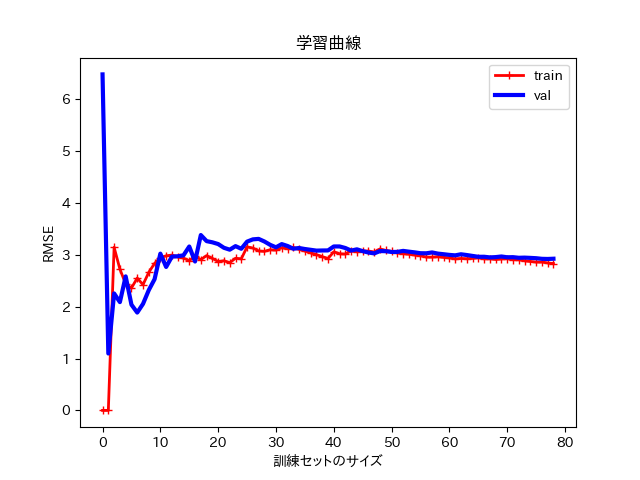
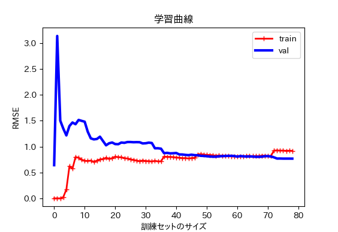
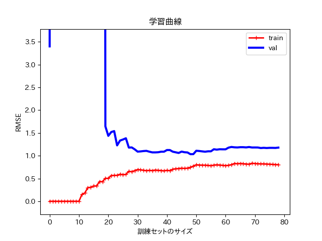

==============================================================================
学習曲線
==============================================================================

.. contents:: 目次

学習曲線とは？
==============================================================================

多項式回帰のところで，どの程度の次数が適正なのか，
調べることが重要であると伝えました．

それを調べるために学習曲線というものがあります．

学習曲線は，テストデータと訓練データで訓練サイズごとのRMSEの値を計算し，グラフにしたものです．

学習曲線は以下のコードで確認することができます．

.. code-block :: python
   :caption: 学習曲線（learning_curve.py）

   import matplotlib.pyplot as plt
   import numpy as np
   from sklearn.metrics import mean_squared_error
   from sklearn.model_selection import train_test_split
   from sklearn import linear_model

   def plot_learning_curves(model, X, y):
           X_train, X_val, y_train, y_val = train_test_split(X, y, test_size = 0.2)
           train_errors, val_errors = [], []
           for m in range(1, len(X_train)):
                   model.fit(X_train[:m], y_train[:m])
                   y_train_predict = model.predict(X_train[:m])
                   y_val_predict = model.predict(X_val[:m])
                   train_errors.append(mean_squared_error(y_train_predict, y_train[:m]))
                   val_errors.append(mean_squared_error(y_val_predict, y_val[:m]))
           plt.plot(np.sqrt(train_errors), "r-+", linewidth = 2, label = "train")
           plt.plot(np.sqrt(val_errors), "b-", linewidth = 3, label = "val")

   m = 100
   X = 6 * np.random.rand(m, 1)
   y = -1 * X**2 + 6 * X + 1 + np.random.randn(m, 1)
   lin_reg = linear_model.LinearRegression()

   import matplotlib as mpl
   mpl.rcParams['font.family'] = 'IPAPGothic'
   # mpl.rcParams['font.family'] = 'AppleGothic'
   mpl.use('Agg')
   plot_learning_curves(lin_reg, X, y)
   plt.title('学習曲線')
   plt.xlabel('次数')
   plt.ylabel('RMSE')
   plt.legend()
   plt.show()

上のコードを実行すると，下のような学習曲線が出てきます．

この学習曲線は直線（一次式）における学習曲線です．
trainとは，訓練データのことで，valはテストデータのことです．

両方の曲線が一定の水準に達しともに非常に接近していますが，全体として誤差（RMSE）が大きいため
典型的な過少適合です．

次に，2次関数における学習曲線を確認してみます．

.. code-block :: python
   :caption: 二次関数における学習曲線（learning_curve_2.py）

   import matplotlib.pyplot as plt
   import numpy as np
   from sklearn.metrics import mean_squared_error
   from sklearn.model_selection import train_test_split
   from sklearn import linear_model

   def plot_learning_curves(model, X, y):
           X_train, X_val, y_train, y_val = train_test_split(X, y, test_size = 0.2)
           train_errors, val_errors = [], []
           for m in range(1, len(X_train)):
                   model.fit(X_train[:m], y_train[:m])
                   y_train_predict = model.predict(X_train[:m])
                   y_val_predict = model.predict(X_val[:m])
                   train_errors.append(mean_squared_error(y_train_predict, y_train[:m]))
                   val_errors.append(mean_squared_error(y_val_predict, y_val[:m]))
           plt.plot(np.sqrt(train_errors), "r-+", linewidth = 2, label = "train")
           plt.plot(np.sqrt(val_errors), "b-", linewidth = 3, label = "val")

   m = 100
   X = 6 * np.random.rand(m, 1)
   y = -1 * X**2 + 6 * X + 1 + np.random.randn(m, 1)

   from sklearn.preprocessing import PolynomialFeatures
   from sklearn import linear_model
   poly_features = PolynomialFeatures(degree = 2, include_bias = False)
   X_poly = poly_features.fit_transform(X)

   from sklearn.pipeline import Pipeline
   polynomial_regression = Pipeline([
        ("poly_features", PolynomialFeatures(degree=2, include_bias = False)),
        ("lin_reg", linear_model.LinearRegression()),
        ])

   import matplotlib as mpl
   mpl.rcParams['font.family'] = 'IPAPGothic'
   # mpl.rcParams['font.family'] = 'AppleGothic'
   mpl.use('Agg')
   plot_learning_curves(polynomial_regression, X, y)
   plt.title('学習曲線')
   plt.xlabel('訓練セットのサイズ')
   plt.ylabel('RMSE')
   plt.legend()
   plt.show()
   plt.close()

両方の曲線がある程度の水準で接近しており，全体としての誤差（RMSE）も小さいため
他のものよりも程よく適合していると考えられます．

最後に，10次関数における学習曲線を確認してみます．

直線における学習曲線よりも，訓練誤差（RMSE）がかなり小さく，また二つの曲線の間に大きな差がある．
特に，テストデータに対しての性能よりも，訓練データに対する性能がかなり高く，典型的な過学習です．

