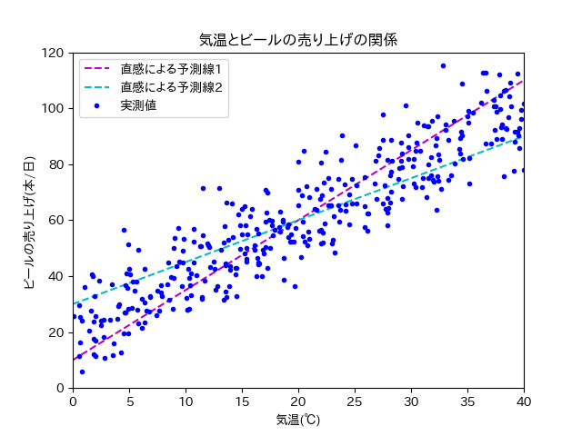

==============================================================================
線形回帰（回帰分析）
==============================================================================

.. contents:: 目次

機械学習は何がしたいのか？
==============================================================================
機械学習は"既知"のものから"未知"のものを予測したいのです．

予測できると何が嬉しいのか？
具体例を考えてみましょう．

あるスーパーの店長は，利益を上げるために効率よくビールを仕入れたいと考えました．
その日に売れるビールの本数をぴったり仕入れることができれば，利益は上がるはずです．

つまり，その日に売れるビールの本数が予測したいわけです．

店長は気温とビールの売り上げに関係があると考えました．
日付ごとに平均気温，ビールの売り上げ本数は分かっています
（平均気温は気象庁のサイトからある程度調べられる．店の日毎の売り上げは当然分かるはず）.

365日分，平均気温とビールの売り上げの関係を調べ，散布図を書きました
（私が適当に作ったデータです．現実にこうであるかは知りません．）．
下の散布図はデータ数が365日分なので，プロットが365個（青い点が365個）あります．

.. image:: image/linear_regression/temperature_and_beer1.png
   :scale: 90%

単純な右肩上がりのプロットが見て取れます．
過去365日分のデータから，平均気温とビールの売り上げ本数の関係性がうっすらと見えますね．

では明日は，ビールをどのくらい仕入れればいいでしょうか？
天気予報を見てみると，気温は30℃くらいになりそうとのこと．

散布図に直感で2本の予測線を引いてみました．

どっちの直線がより正確に平均気温とビールの売り上げ本数の関係性を表しているでしょうか．

あるいはどのような線を使えば，最も正確に平均気温とビールの売り上げ本数の関係性を表せるでしょうか．

紫色の点線に従えば80本，水色の点線に従えば75本と予想できます．
ただこれはあくまで，散布図をもとに直感で予測線を描いたものです．

もし平均気温とビールの売り上げの関係が数式で求められたら，直感で引いた予測線よりは正確に売り上げを予測できそうですね．

予測するためには何が必要なの？（数式を書くには何が必要なの？）
==============================================================================

数式で平均気温とビールの売り上げ本数の関係性を表せたら，散布図の中に関係性を表した線（予測線）が描けるはずです．

今回は平均気温とビールの売り上げ本数の関係性を直線の式（一次式）で表してみましょう．
直線の式で表すことができれば，予測線を直線で描けます．

直線の式といえば，y = ax + b と言うものが有名でしょうか．
上の例で考えてみると，平均気温がx，ビールの売り上げがyとなります．

式に当てはめてみれば，気温が30℃の時には，ビールの売り上げは30a + b本となります．
ビールの売り上げ本数が予測できましたね！（やったー！！！）

...はい．
お気づきだと思いますが，30a + b本なんて言われても何にもわかりません．
予測もへったくれもありません．

もっと具体的に（例えば40本やら50本など）わからなければ，予測にはなりません．

つまり予測をするためには，直線の傾き（a）や切片（b）などの **パラメータ** を求める必要があります．

パラメータはどうやって求めるの？
==============================================================================

直線の式：y = ax + b において，パラメータ（a, b）の最適解は，正規方程式という頭のいい人が見つけたすごい技を使えば算出できます．
計算もパソコンがやってくれますので，書き写せばきっと皆さんも使えます（後でやってもらいます）．

.. image:: image/linear_regression/temperature_and_beer3.png
   :scale: 90%

正規方程式とやらを使ってパラメータを求め，予測線を描いてみました．

では，正規方程式で算出したパラメータ（a, b）を使えば，世界で一番良い予測線となるでしょうか？

それは全数調査が行われた（すべてのデータを持っている）時のみ，yesとなります（正確にはちょい違う気もしますが，今回はこの説明で許してください）．

なぜなら正規方程式で算出したパラメータ（a, b）は，あくまで計算に使ったプロット（上の例で言うと365日分）の中で，一番一番良いパラメータであるだけです．
計算に使わなかったプロット（スーパーを一年以上経営していれば，365日分以上データはあります）を使用すれば，また別のパラメータが出てきます．

しかし問題を解決しようとした際（あるいは予測をしようとした際），全数調査を行うこと自体が現実的ではありません．

そのため代替案として，どうやって手元にあるデータから全体を予測するのかが大事になります．
具体的にはどのようにしてパラメータの求めるのかが大事になります．

ちなみに手元にあるデータから全体を予測するという考え方は，まさしく統計の基本的な考え方となります．

次章，勾配降下法に続く

.. note :: 

   直線は，二点が分かれば描くことができます．
   つまりプロットが二つ（上の例で言うと二日分）あれば，直線は引けます．
   でもプロットが三つ（上の例で言うと三日分）以上ある時，すべてのデータが一つの直線上にあることは，かなり珍しいです（現実世界では多分ないです）．

   なので，すべてのデータが一直線上にあるような，完璧な予測はほぼ不可能です．
   よって妥協案としてプロットと直線の誤差（距離の総和）が一番小さくなるような直線を，一番良い予測線と考えます．

   ここで言うところの"誤差（距離の総和）"を，RMSEやMSEで表現しています．

実習1：プロットを描いてみよう！
==============================================================================

実習1ではまず，上の説明で出てきたプロットを描いてみましょう！

上の説明で提示した「散布図」および「正規方程式による予測線」は下のコードで描くことができます．

皆さんは昨日の実習でvimを使ったと思うので，こちらでもvimを使います（各自で何か使っているものがあれば，そちらを使ってください）．

.. note ::
   :kbd:`Finder` > :kbd:`アプリケーション` > :kbd:`ユーティリティ` > :kbd:`ターミナル` でターミナルが開けます．

   ターミナルは菊池研でよく使う可能性があるので，Dock（下のメニューバー）に追加しておくことを勧めておきます．
   :kbd:`ターミナル` のアイコンを二本指でタップして，オプションからDockに追加ができます．

ターミナルに :code:`vim` と入力し，以下のコードを書いてください．
コピペで構いません．

.. code-block :: python
   :caption: 散布図と正規方程式による予測線（normal_equation.py）

   import numpy as np

   n = 365
   error_size = 10
   X = 40 * np.random.rand(n, 1)
   y = 20 + 2 * X + error_size * np.random.randn(n, 1)

   X_b = np.c_[np.ones((n, 1)), X] 
   theta_best = np.linalg.inv(X_b.T.dot(X_b)).dot(X_b.T).dot(y)
   print(theta_best)

   X_new = np.array([[0], [40]])
   X_new_b = np.c_[np.ones((2,  1)), X_new]
   y_predict = X_new_b.dot(theta_best)

   # import matplotlib as mpl
   # mpl.rcParams['font.family'] = 'IPAPGothic'
   # mpl.rcParams['font.family'] = 'AppleGothic'
   import matplotlib.pyplot as plt
   plt.plot(X_new, y_predict, "r-", label = "正規方程式による予測線")
   plt.plot(X, y, "b.", label = "実測値: y = 2x + 20 + error")
   plt.axis([0, 40, 0, 150])
   plt.title('気温とビールの売り上げの関係')
   plt.xlabel('気温(℃)')
   plt.ylabel('ビールの売り上げ(本/日)')
   plt.legend(loc = 'upper left')
   plt.show()
   plt.close()

書き終わったら，ノーマルモード（ :kbd:`esc`）にして，:kbd:`:w ./normal_equation.py` と入力してください．
その後，:kbd:`:q` と入力して，いつものターミナルの画面に戻ります．

-  もう一度，スクリプトを開くには :code:`vim ./normal_equation.py` とすればよいです．

以下のようにプログラムを実行してもらうと，おそらく下のようなプロットが出てきます．

.. code-block:: bash

   $ python3 ./normal_equation.py

.. warning:: 先頭の $ は書いてはいけません．

   - これは，ターミナルで実行してくださいという意味です．
   - $ の無い部分は出力です．

.. image:: image/linear_regression/temperature_and_beer4.png
   :scale: 90%

まずは上のようなプロットを出してみてください
（フォントの関係で，日本語で記載したグラフタイトルや軸ラベルなどが，お豆腐になる可能性があります．本質的には問題ないので，今回はそのまんまで）．

これでひとまずプロットが書けました．
ターミナルを見てみると，以下のような表示があると思います．

.. code-block:: bash

   $ python3 normal_equation.py 
   [[20.81115726]
    [ 1.96813527]]

上の20くらいの数字が，予測線の切片を表しています．
下の2くらいの数字が，予測線の傾きを表しています．

直線の式で表現すると，y = 1.97x + 20.81 となります．

実測値（青い点）はy = 2x + 20 + error をベースに作成したので，おおよそ予測ができていると言っていいでしょう．

.. note ::
   ターミナルでの作業を行う際には，プロットを消す必要があります．
   プロットを残しておきたい人は，スクリーンショットでも取っておいてください．

   コードで保存するやり方もありますが，ここでは説明しません．

実習1の内容
**************************************************************************

上のコードを実行して，プロットを表示させてください．

また，プロットを表示させた際の，ターミナルに表示される数字を確認してください．

実習2：プロットを変化させてみよう！
==============================================================================

実習1でプロットを描くことができました．
次は数字をいろいろいじってプロットを変化させてみましょう！

下のコードは先ほど書いてもらったコードです．
上から読んでいって二つ目のブロックに注目してください．

.. code-block :: python
   :caption: 散布図と正規方程式による予測線（normal_equation.py）

   import numpy as np

   n = 365
   error_size = 10
   X = 40 * np.random.rand(n, 1)
   y = 20 + 2 * X + error_size * np.random.randn(n, 1)

   X_b = np.c_[np.ones((n, 1)), X] 
   theta_best = np.linalg.inv(X_b.T.dot(X_b)).dot(X_b.T).dot(y)
   print(theta_best)

   X_new = np.array([[0], [40]])
   X_new_b = np.c_[np.ones((2,  1)), X_new]
   y_predict = X_new_b.dot(theta_best)

   # import matplotlib as mpl
   # mpl.rcParams['font.family'] = 'IPAPGothic'
   # mpl.rcParams['font.family'] = 'AppleGothic'
   import matplotlib.pyplot as plt
   plt.plot(X_new, y_predict, "r-", label = "正規方程式による予測線")
   plt.plot(X, y, "b.", label = "実測値: y = 2x + 20 + error")
   plt.axis([0, 40, 0, 150])
   plt.title('気温とビールの売り上げの関係')
   plt.xlabel('気温(℃)')
   plt.ylabel('ビールの売り上げ(本/日)')
   plt.legend(loc = 'upper left')
   plt.show()
   plt.close()

以下のような記述があったと思います．

.. code-block :: python

   n = 365
   error_size = 10

nやerror_sizeを説明すると下のようになります．

- n：サンプル数
- error_size：誤差の大きさ

雑な言い方をするとnを大きくすると（365より大きい数字を代入すると），青い点の数が増えます．
error_sizeを大きくすると，青い点がy軸方向（縦軸方向）に広がりやすくなります．

nやerror_sizeに代入する値を変化させて，プロットやパラメータがどのように変化するのかを調べてください．
またプロットやパラメータの変化から，nやerror_sizeがどのような影響をもたらすのか，考えてください．

実習2の内容
**************************************************************************

nやerror_sizeに代入する値を変化させて出てくるプロットから，今回の手法（回帰分析）の特徴や弱点を考察してください．

