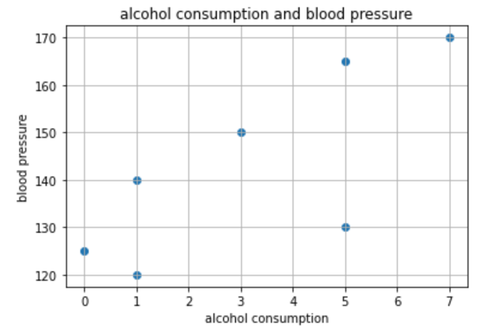

=====================================================
単回帰分析
=====================================================

単回帰分析は、2つの変数の連動に影響関係を想定し、一方の変数がもう一方
の変数に与える影響を **直線の式** によって表すことで、**予測** や **説明** を可能にする方法です。

ビジネスの世界でよく使われています。
「ある商品の売り上げ」が何に影響を受けているのか、
例えば、「アイスの売り上げ」がどれだけ「気温」の影響を受けているか、「ビールの売り上げ」がどれだけ「気温」の影響を受けているか、
「ジュースの売り上げ」がどれだけ「宣伝費用」の影響を受けているか
など様々な分析で使われています。

２変数間において、影響を受ける変数を目的変数（従属変数）、影響を与える変数を説明変数（独立変数）と言います。

また、直線の式は、

.. math:: y = a + bx　

と表し回帰直線と呼びます。

**y** が目的変数の予測値で、 **a** が切片、**b** は傾き(回帰係数) **x** は説明変数です。

簡単に言ってしまえば、目的変数を説明変数を使ってどれだけ予測、説明できるのかを分析しよう、ということです。

早速手を動かして理解を深めてみましょう。
回帰分析をすることでどのようなことが行えるようになるのか、さらにイメージを膨らませてみてください。

分析は :code:`google colaboratory` を使って行います。
:code:`google cplaboratory` はブラウザから簡単に :code:`python` を動かすことができるツールです。

例題:「1日の平均飲酒量」と「血圧」の関係
=====================================================

「1日の平均飲酒量」と「血圧」にはどのような関係があるか調べてみましょう。

.. image:: image/linear_regression/table1.png
   :scale: 50%

１日の平均飲酒量と血圧のデータがあるとします。

この表だけみてもあまりピンときません。
じっくりデータを見てみましょう。
また当然ですが確定的なことはまだ何も言えません。

では次に散布図で可視化してみましょう。また相関係数も見てみましょう。

.. code-block :: python
   :caption: 飲酒量と血圧の散布図

   # ライブラリのインポート
   import pandas as pd
   import numpy as np
   import matplotlib.pyplot as plt

   # pandasのDataFrameによる二次元配列の作成
   df = pd.DataFrame([[0,125],[1,120],[1,140],[3,150],[5,130],[7,170],[5,165]], columns=['1日の平均飲酒量(瓶ビールの本数)','血圧'])

   # 説明変数
   x = df['1日の平均飲酒量(瓶ビールの本数)']
   # 目的変数
   y = df['血圧']

   # 散布図の作成
   plt.scatter(x, y)
   plt.title('alcohol consumption and blood pressure')
   plt.xlabel('alcohol consumption')
   plt.ylabel('blood pressure')
   plt.grid()
   plt.show()

   # 相関係数
   xy_corrcoef = np.corrcoef(x, y)
   print('相関係数：{}'.format(round(xy_corrcoef[1][0], 2)))

相関係数は、0.76です。
この２変数間の関係には、強い相関があるということは言えるようになりました。

また、この散布図を見る限り、どうやら1日の平均飲酒量が増えると、血圧も上っていくように見えます。
しかし、まだこの時点ではそのような確定的なことは言えません。

相関係数はあくまでも２変数の関係の強さを数値で表すだけで、一方の変数がもう一方
の変数に与える影響について断定することはできません。

そこで回帰分析の登場です。

回帰分析をすることで、どちらかの変数が他方の変数に影響を与えているという方向を考えることができるようになります。
散布図と相関係数から、「１日の平均飲酒量」が「血圧」に影響を与えている **っぽい** です。
本当かどうか調べてみましょう。

目的変数を「血圧」、説明変数を「1日の平均飲酒量」とします。

求める回帰式は

.. math::

   血圧予測値 = a + b \times 1日の平均飲酒量

です。

また、1日の平均飲酒量の回帰係数bについて、仮説を立てて回帰分析を行うことになります。
回帰分析における帰無仮説と対立仮説は以下の通りです。

.. math::

   H0: b = 0

   H1: b ≠ 0

1日の平均飲酒量の回帰係数が0である、ということを帰無仮説として検定を行うことになります。
もし **H0** を棄却できなければ、回帰分析にはあまり意味がないということになります。
**H0** を棄却でき、H1が成立すれば、回帰分析の有意性を主張することができます。

それでは「１日の平均飲酒量」が「血圧」に影響を与えているのかどうかを回帰分析で調べてみます。

まずは :code:`python` の :code:`statsmodels` ライブラリを使って回帰分析をしてみます。

.. code-block :: python
   :caption: 回帰直線の作成

   import matplotlib.pyplot as plt
   import statsmodels.api as sm
   import pandas as pd

   df = pd.DataFrame([[0,125],[1,120],[1,140],[3,150],[5,130],[7,170],[5,165]], columns=['1日の平均飲酒量(瓶ビールの本数)','血圧'])
   x = df['1日の平均飲酒量(瓶ビールの本数)']
   y = df['血圧']

   # 切片(定数項)が必要なので切片を追加、statsmodelsの仕様でこれがないと切片が0で出力される）
   X = sm.add_constant(x)

   # 最小二乗法によるmodel作成
   results = sm.OLS(y, X).fit()

結果を出力してみます。

.. code-block :: python
   :caption: 結果の出力

   # 結果の出力
   print(results.summary())

   # 切片と回帰係数
   a = results.params[0]
   b = results.params[1]

   # 散布図
   plt.scatter(x, y)
   plt.title('alcohol consumption and blood pressure')
   plt.xlabel('alcohol consumption')
   plt.ylabel('blood pressure')
   plt.grid()

   # 散布図に回帰直線の追加
   plt.plot(x, a+b*x)
   plt.show()

.. image:: image/linear_regression/result_linear_regression.png
   :scale: 50%

.. note::
  散布図に回帰直線を引くときには、色々な回帰直線を引くことができます。
  しかし、回帰分析で求めるのは、「もっともうまくyを予測できる直線」、つまり **最適な** 回帰直線です。
  最適な回帰直線を求めるには、最小二乗法を用います。
  最小二乗法を使うと、「実測値と予測値のズレ（残差）の２乗の和を最小にする」ことでもっとも確からしい回帰直線を引くことができます。
  こちらの解説がわかりやすいです。　https://www.youtube.com/watch?v=Zz1sgYxrA-k

この回帰直線の式は

.. math::
  y = 125 + 5.68x

となりました。

また、説明率である決定係数(R-squared)が0.575、
飲酒量の回帰係数におけるp値も0.048で有意水準5%以下で有意となり、H0を棄却できます。
無事、1日の平均飲酒量で血圧を約57%を説明できるということになりました。

もしも1日の平均飲酒本数が０ならば血圧が125、飲酒本数が１本増えるごとに血圧が5.68増えています。

それでは、1日に平均で6本飲酒している人の血圧はどうでしょうか。
実際に6本飲酒している人のデータはありません。
しかしこの回帰直線があれば、

.. math::
  159.08 = 125 + 5.68 \times 6

1日に平均で6本飲酒している人の血圧はだいたい159くらいということがわかります。

6本飲酒している人のデータはありませんが回帰直線のおかげで **予測** することができました。

また、例えばこの回帰直線のように、
「飲酒量」が増えれば「血圧」も上がってしまう ということを客観的に表すことができたので、
「飲酒量を抑えることで、血圧の上昇を抑えることができる」
という説得力のある **説明** 、主張が可能になります。

これが回帰分析における
「一方の変数がもう一方の変数に与える影響を **直線の式** によって表すことで、**予測** や **説明** を可能にする」
ということです。

イメージ湧きましたか？

しかし皆さんは勘付いていると思いますが、

血圧の上昇って、飲酒量だけで説明できるの？

といった疑問が浮かんでいると思います。

当然飲酒量だけでは説明できません。

疑問の通り、血圧の上昇は飲酒量だけでなく、別の変数も絡み合っています。
例えば、**BMI（肥満度）** も血圧に関わってきそうです。

このように実世界では、一つの説明変数で一つの目的変数を説明することが難しいことが多いです。

そこで、行うのが重回帰分析になります。

重回帰分析では２つ以上の説明変数で一つの目的変数を説明することができます。

それでは重回帰分析に進みます。
