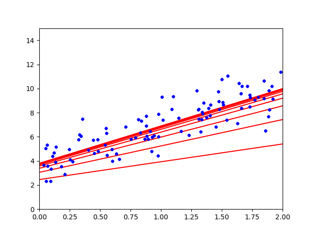

==============================================================================
勾配降下法
==============================================================================

.. contents:: 目次

どうやってパラメータの最適解を求めるのか？
==============================================================================

前回，線形回帰（回帰分析）の章の最後で，
どうやって手元にあるデータから全体を予測するのか，具体的にはどのようにしてパラメータの求めるのかが大事になる，
と言いました．

ここでは，具体的に二つのやり方をお伝えします．

- バッチ勾配降下法
- 確率勾配降下法

どちらも，ランダムな初期パラメータから初めて，
ちょっとずつパラメータを変化させて，
最終的に最適解（誤差MSEが最も小さくなるパラメータ）を見つける手法です．

しかしパラメータを変化させるやり方が異なるため，分けて説明します．

バッチ勾配降下法
==============================================================================

バッチ勾配降下法は，一歩ずつ誤差MSEが小さくなるようパラメータを変化させていきます．

パラメータを変化させていく上で，イテレーションと学習率と言われる指標が重要になっていきます．

崖下り（山登りの逆的な何か）を例に出すと，イテレーションや学習率，誤差MSEは下のようなものになります．

- イテレーション：歩数
- 学習率：歩幅
- 誤差MSE：標高

一定の歩幅，規定の歩数で崖を下っていき，標高を下げていきます．
これ以上標高が下がらない谷底（誤差MSEが最小）に到達したら最適なパラメータがわかる，といった形です．

.. note ::

   歩数があまりにも小さければ，たどり着けません．

   - 谷底までが100mくらいだったとして，3,4歩でたどり着けというのは無理があるでしょう．

   .. image:: image/gradient_descent_method/example1.png
      :scale: 90%

   歩数があまりにも大きければ，無駄に歩くことになります

   - 100歩くらいで着きそうなのに，1000歩歩けと言われたら疲れてしまいます．

   .. image:: image/gradient_descent_method/example2.png
      :scale: 90%

   歩幅があまりにも小さければ，たどり着くまでに時間がかかります．また変な窪みを谷底と勘違いします．

   - 谷底までが100mくらいだったとして，谷底の手前に幅10mの窪みがあった時，歩幅が3mとかだと窪みを超えられず，窪みを谷底と勘違いします．

   .. image:: image/gradient_descent_method/example3.png
      :scale: 90%

   歩幅があまりにも大きければ，変な窪みにハマることはなさそうですが，通り過ぎ続けてしまうでしょう．

   - しかし歩幅が1000m（人間じゃない）あったら，何歩歩いても谷底を通り過ぎ続けてしまうでしょう．

   .. image:: image/gradient_descent_method/example4.png
      :scale: 90%

上の例からも分かるように，バッチ勾配降下法はイテレーションと学習率をいかに良い値にするかが大事になっていきます．

実習3
==============================================================================
下のコードはバッチ勾配降下法を行うためのコードです．

このコードを実行してイテレーション，学習率を変化させて，プロットの変化を確認してみてください．

.. code-block :: python
   :caption: バッチ勾配降下法（batch_gradient_descent_method.py）

   import numpy as np
   X = 2 * np.random.rand(100, 1)
   y = 4 + 3 * X + np.random.randn(100, 1)
   X_b = np.c_[np.ones((100, 1)), X]

   eta = 0.1           # 学習率
   n_iterations = 10   # イテレーション
   m = 100             # サンプル数

   theta = np.random.randn(2, 1)  # 無作為な初期値

   import matplotlib.pyplot as plt
   for iteration in range(n_iterations):
        gradients = 2/m * X_b.T.dot(X_b.dot(theta) - y)
        theta = theta - eta * gradients
        X_new = np.array([[0], [7]])
        X_new_b = np.c_[np.ones((2,  1)), X_new]  # 各インスタンスにx0 = 1 を加える
        y_predict = X_new_b.dot(theta)

        plt.plot(X_new, y_predict, "r-")
        plt.plot(X, y, "b.")
        plt.axis([0, 2, 0, 15])

   print(theta)
   plt.show()

イテレーション（歩数）10回程度だと，だんだん近づいて行っている様子がわかるかと思います．

今回もターミナルを見てみると，以下のような表示があると思います．

.. code-block:: bash

   $ python3 normal_equation.py 
   [[3.79748615]
    [3.09573583]]

上の4くらいの数字が，予測線の切片を表しています．
下の3くらいの数字が，予測線の傾きを表しています．
今回は，y = 3X + 4 + error をベースに作成したので，おおよそ予測はできていると言っていいでしょう．

ここから，学習率やイテレーションを変化させて，上記で説明した問題を引き起こしてください．
サンプル数に関しては，線形回帰の項目で問題を確認してもらったので，変化させなくて大丈夫です．

確率勾配降下法
==============================================================================

