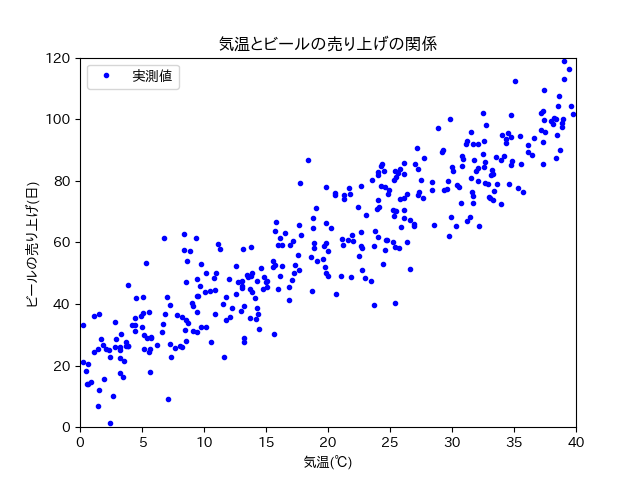

==============================================================================
線形回帰（回帰分析）
==============================================================================

.. contents:: 目次

機械学習は何がしたいのか？
==============================================================================
既知のものから未知のものを予測したい．

予測できると何が嬉しいのか？
具体例を考えてみましょう．

あるスーパーの店長が，気温とビールの売り上げに関係があると考えました．
日付ごとに平均気温，ビールの売り上げ本数は分かっています
（平均気温は気象庁のサイトからある程度調べられる．店の日毎の売り上げは当然分かるはず）.

365日分，平均気温とビールの売り上げの関係を調べ，散布図を書きました
（私が適当に作ったデータです．現実にこうであるかは知りません．）．

単純な右肩上がりのプロットが見て取れます．
過去365日分のデータから，平均気温とビールの売り上げ本数の関係性がうっすらと見えますね．

では明日は，ビールをどのくらい仕入れればいいでしょうか？
天気予報を見てみると，気温は35℃くらいになりそうとのこと．

散布図を見る限り，雰囲気80本前後の売り上げが予測できます．
ただこれはあくまで，散布図をもとにフィーリングで予測しました．

もし平均気温とビールの売り上げの関係が，数式で表現できたらフィーリングよりは正確に売り上げを予測できそうですね．

予測するためには何が必要なの？
==============================================================================

「一方の変数が他方の変数に与える影響を直線の式によって表す」方法です．

直線の式といえば，y = ax + b と言うものが有名でしょうか．

変数はxとyですね．

つまり予測するためには，aやbなどのパラメータを求める必要があります．

パラメータはどうやって求めるの？
==============================================================================
集団の最適解は，正規方程式という頭のいい人が考えたすごい技を使えば出せます．
でも全数調査が必要だよね？

全数調査て現実的に考えてほぼ不可能だよね？

だから，パラメータの求め方が色々あるんです．

次章，勾配降下法に続く

回帰分析ってなんだっけ？
==============================================================================

回帰分析とは何か？

データリテラシーを受けてきた皆さんは，単回帰分析やら重回帰分析やらを勉強してきたはずです．
具体的にはデータリテラシーⅡの教科書48-51ページ（第七回）で，回帰分析について簡単な説明が記載されています．

該当ページにて記載されている回帰分析について記述します．

| 回帰分析（regression analysis）は，2つの変数の連動に影響関係を想定し，一方の変数が他方の変数に与える影響を直線の式によって表すことで，予測や説明を可能にする方法です．
|
| - データリテラシーⅡ, p.48, 2017

上記の説明では影響を与える側の変数と，影響を受ける側の変数がありました．

影響を与える側の変数をいわゆる「説明変数」といい，
影響を受ける側の変数をいわゆる「目的変数」と言います．

教科書の記述から，回帰分析とは「説明変数」と「目的変数」の関係を直線の式で表すことを

上でチラッと出てきた単回帰分析やら重回帰分析やらですが，単回帰分析は説明変数が一つの回帰分析，重回帰分析は説明変数が複数ある回帰分析となっております．

