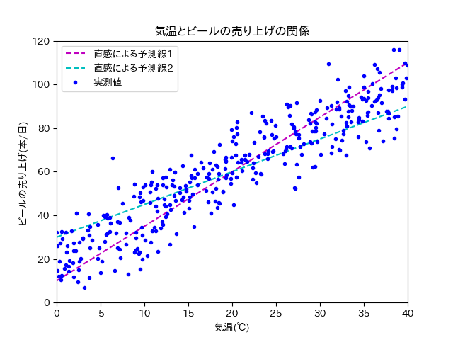

==============================================================================
線形回帰（回帰分析）
==============================================================================

.. contents:: 目次

機械学習は何がしたいのか？
==============================================================================
機械学習は"既知"のものから"未知"のものを予測したいのです．

予測できると何が嬉しいのか？
具体例を考えてみましょう．

あるスーパーの店長は，利益を上げるために効率よくビールを仕入れたいと考えました．
その日に売れるビールの本数をぴったり仕入れることができれば，利益は上がるはずです．

つまり，その日に売れるビールの本数が予測したいわけです．

店長は気温とビールの売り上げに関係があると考えました．
日付ごとに平均気温，ビールの売り上げ本数は分かっています
（平均気温は気象庁のサイトからある程度調べられる．店の日毎の売り上げは当然分かるはず）.

365日分，平均気温とビールの売り上げの関係を調べ，散布図を書きました
（私が適当に作ったデータです．現実にこうであるかは知りません．）．
下の散布図はデータ数が365日分なので，プロットが365個（青い点が365個）あります．

.. image:: image/linear_regression/temperature_and_beer1.png
   :scale: 90%

単純な右肩上がりのプロットが見て取れます．
過去365日分のデータから，平均気温とビールの売り上げ本数の関係性がうっすらと見えますね．

では明日は，ビールをどのくらい仕入れればいいでしょうか？
天気予報を見てみると，気温は30℃くらいになりそうとのこと．

散布図に直感で2本の予測線を引いてみました．

どっちの直線がより正確に平均気温とビールの売り上げ本数の関係性を表しているでしょうか．

あるいはどのような線を使えば，最も正確に平均気温とビールの売り上げ本数の関係性を表せるでしょうか．

赤い点線に従えば80本，黄色い点線に従えば75本と予想できます．
ただこれはあくまで，散布図をもとに直感で予測線を描いたものです．

もし平均気温とビールの売り上げの関係が数式で求められたら，直感で引いた予測線よりは正確に売り上げを予測できそうですね．

予測するためには何が必要なの？（数式を書くには何が必要なの？）
==============================================================================

数式で平均気温とビールの売り上げ本数の関係性を表せたら，散布図の中に関係性を表した線（予測線）が描けるはずです．

今回は平均気温とビールの売り上げ本数の関係性を直線の式（一次式）で表してみましょう．
直線の式で表すことができれば，予測線を直線で描けます．

直線の式といえば，y = ax + b と言うものが有名でしょうか．
上の例で考えてみると，平均気温がx，ビールの売り上げがyとなります．

式に当てはめてみれば，気温が30℃の時には，ビールの売り上げは30a + b本となります．
ビールの売り上げ本数が予測できましたね！（やったー！！！）

...はい．
お気づきだと思いますが，30a + b本なんて言われても何にもわかりません．
予測もへったくれもありません．

もっと具体的に（例えば40本やら50本など）わからなければ，予測にはなりません．

つまり予測をするためには，直線の傾き（a）や切片（b）などの **パラメータ** を求める必要があります．

パラメータはどうやって求めるの？
==============================================================================

直線の式：y = ax + b において，パラメータ（a, b）の最適解は，正規方程式という頭のいい人が見つけたすごい技を使えば算出できます．
計算もパソコンがやってくれますので，書き写せばきっと皆さんも使えます．

では，正規方程式で算出したパラメータ（a, b）を使えば，世界で一番良い予測線となるでしょうか？

それは全数調査が行われた（すべてのデータを持っている）時のみ，yesとなります（正確にはちょい違う気もしますが，今回はこの説明で許してください）．

なぜなら正規方程式で算出したパラメータ（a, b）は，あくまで計算に使ったプロット（上の例で言うと365日分）の中で，一番一番良いパラメータであるだけです．
計算に使わなかったプロット（スーパーを一年以上経営していれば，365日分以上データはあります）を含めれば，また別のパラメータが出てきます．

しかし問題を解決しようとした際（あるいは予測をしようとした際），全数調査を行うこと自体が現実的ではありません．

そのため代替案として，どうやって手元にあるデータから全体を予測するのかが大事になります．
具体的にはどのようにしてパラメータの求めるのかが大事になります．

ちなみに手元にあるデータから全体を予測するという考え方は，まさしく統計の基本的な考え方となります．

次章，勾配降下法に続く

二点分かれば，直線はかける．
つまりプロットが二つ（上の例で言うと二日分）あれば，直線は引ける．
でもプロットが三つ（上の例で言うと三日分）以上ある時，すべてのデータが一つの直線上にあることは，かなり珍しいです（現実世界では多分ないです）．

なので，すべてのデータが一直線上にあるような，完璧な予測はほぼ不可能です．
よって妥協案としてプロットと直線の誤差（距離の総和）が一番小さくなるような直線を，一番良い予測線と考えます．

回帰分析ってなんだっけ？
==============================================================================

回帰分析とは何か？

データリテラシーを受けてきた皆さんは，単回帰分析やら重回帰分析やらを勉強してきたはずです．
具体的にはデータリテラシーⅡの教科書48-51ページ（第七回）で，回帰分析について簡単な説明が記載されています．

該当ページにて記載されている回帰分析について記述します．

| 回帰分析（regression analysis）は，2つの変数の連動に影響関係を想定し，一方の変数が他方の変数に与える影響を直線の式によって表すことで，予測や説明を可能にする方法です．
|
| - データリテラシーⅡ, p.48, 2017

上記の説明では影響を与える側の変数と，影響を受ける側の変数がありました．

影響を与える側の変数をいわゆる「説明変数」といい，
影響を受ける側の変数をいわゆる「目的変数」と言います．

教科書の記述から，回帰分析とは「説明変数」と「目的変数」の関係を直線の式で表すことを

上でチラッと出てきた単回帰分析やら重回帰分析やらですが，単回帰分析は説明変数が一つの回帰分析，重回帰分析は説明変数が複数ある回帰分析となっております．

