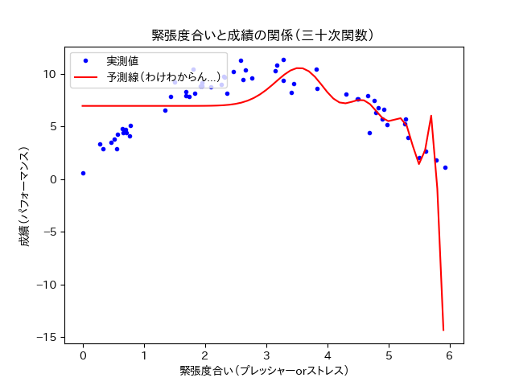
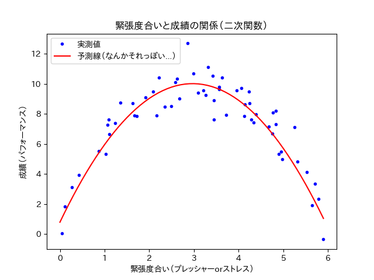
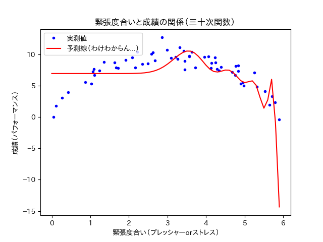

==============================================================================
多項式回帰
==============================================================================

.. contents:: 目次

直線による予測の限界
==============================================================================

今までのデータセットは単純な直線型でした．
しかし世の中の事象はそんなに簡単に説明できることばっかりではありません．
今回はちょっと強引かもしれませんが，また一つ例を出します．

あるクラスで，テスト前の緊張度合いとテストの点数の関係を調べました．

緊張度合いは，心拍などの生理指標をもとに評価されます．
テストの点数は15点満点です．

クラスメイト100人のテストの点数と，緊張度合いを散布図にしました
（くどいようですが，私が適当に作ったデータです．
現実にこうであるかは知りません．）．

下の散布図にはデータが100人分あるので，青い点が100個あります．

下のコードを実行すれば，直線で予測線を引くことができます．
ひとまず下のコードを実行してみてください．

.. code-block :: python
   :caption: 多項式回帰？（polynomial_regression_mistake.py）

   import numpy as np

   m = 100
   X = 6 * np.random.rand(m, 1)
   y = -1 * X**2 + 6 * X + 1 + np.random.randn(m, 1)

   X_b = np.c_[np.ones((m, 1)), X]
   theta_best = np.linalg.inv(X_b.T.dot(X_b)).dot(X_b.T).dot(y)
   print(theta_best)

   X_new = np.array([[0], [6]])
   X_new_b = np.c_[np.ones((2,  1)), X_new]
   y_predict = X_new_b.dot(theta_best)

   # import matplotlib as mpl
   # mpl.rcParams['font.family'] = 'IPAPGothic'
   # mpl.rcParams['font.family'] = 'AppleGothic'
   # mpl.use('Agg')
   import matplotlib.pyplot as plt
   plt.plot(X_new, y_predict, "r-", label = "予測線（なんか変．．．）")
   plt.plot(X, y, "b.", label = "実測値")
   plt.axis([0, 6, 0, 12])
   plt.title('緊張度合いと成績の関係')
   plt.xlabel('緊張度合い（プレッシャーorストレス）')
   plt.ylabel('成績（パフォーマンス）')
   plt.legend(loc = 'upper left')
   plt.show()
   plt.close()

下のようなプロットが出てきたと思います
（フォントの関係で，日本語で記載したグラフタイトルや軸ラベルなどが，お豆腐になる可能性があります．
本質的には問題ないので，今回はそのまんまで）．

.. image:: image/polynomial_regression/pressure_and_performance2.png
   :scale: 90%

そりゃそうなりますよね．
明らかに，散布図が直線じゃなさそうなのに，直線で予測線を探ってみても全く意味がありません．

直線で予測線が作れなさそうな時には，直線ではなく曲線（多項式）で予測線を探る必要があります．

曲線（多項式）による予測
==============================================================================

直線では予測線が作れなさそう．．．

ならば，曲線（多項式）で予測線を作ってみましょう！
具体的には，二次関数で予測線を作ってみましょう！！

二次関数といえば，y = aX^2 + bX + c みたいな式が有名でしょう．
確かにこんな感じの式に当てはめれば，うまくいきそうな気がします
（上手くいってほしい．．．）．

下のコードを実行すれば，二次関数で予測線を描くことができます．

.. code-block :: python
   :caption: 多項式回帰（polynomial_regression.py）

   import numpy as np

   m = 100
   X = 6 * np.random.rand(m, 1)
   y = -1 * X**2 + 6 * X + 1 + np.random.randn(m, 1)

   from sklearn.preprocessing import PolynomialFeatures
   from sklearn import linear_model
   poly_features = PolynomialFeatures(degree = 2, include_bias = False)
   X_poly = poly_features.fit_transform(X)

   lin_reg = linear_model.LinearRegression()
   lin_reg.fit(X_poly, y)
   lin_reg.intercept_, lin_reg.coef_

   X_new = np.arange(0, 6, 0.1)
   y_predict = lin_reg.coef_[0, 1] * X_new**2 + lin_reg.coef_[0, 0] * X_new + lin_reg.intercept_[0]

   # import matplotlib as mpl
   # mpl.rcParams['font.family'] = 'IPAPGothic'
   # mpl.rcParams['font.family'] = 'AppleGothic'
   # mpl.use('Agg')
   import matplotlib.pyplot as plt
   plt.plot(X, y, "b.", label = "実測値")
   plt.plot(X_new, y_predict, "r-", label = "予測線（なんかそれっぽい...）")
   plt.title('緊張度合いと成績の関係')
   plt.xlabel('緊張度合い（プレッシャーorストレス）')
   plt.ylabel('成績（パフォーマンス）')
   plt.legend(loc = 'upper left')
   plt.show()

下のようなプロットが出てきたと思います
（くどいですが，フォントの関係で，日本語で記載したグラフタイトルや軸ラベルなどが，お豆腐になる可能性があります．
本質的には問題ないので，今回はそのまんまで）．

.. image:: image/polynomial_regression/pressure_and_performance3.png
   :scale: 90%

全体的にすごくそれっぽくなったと思います．

曲線（二次関数）で予測線を作ったところ，直線（一次関数）よりもより正確に予測線を作ることができました．
ではもっと予測線の次数をあげれば，より正確な予測線になるでしょうか？

試しに曲線（九次関数）で予測線を作ってみます．

上の図をごらんください．
絶妙にふにゃふにゃして，それはもうよく分からない曲線が引いてあります．

この曲線は確かに，今ある青い点を非常に正確に予測できているのかもしれません．
しかし，本来の目的は未知のことを予測することだったはずです．

未知のことをきちんと予測できるのか，二次関数と九次関数で，範囲を広げて予測線を描いて確認してみましょう．
曲線を描くためのパラメータは上と同じものを使用します．

青い点が描く曲線は変わっていません．

二次関数は，範囲が広がっても（未知の値に対しても）比較的綺麗に予測できています．
対して九次関数は，範囲が広がった場所で（未知の値に対して）見当違いな予測をしています．

.. note ::
   次数が低いうちは大雑把な予測しかできません．
   その代わり，未知の値に対してある程度の柔軟性を持っています．

   逆に次数を極端にあげてしまうと，既存のものに対してはより正確な予測ができますが，
   柔軟な予測線ではなくなり，未知の値に対して脆弱になってしまいます．

未知のことを予測するという観点では，今回は二次関数の方が九次関数より優れていそうです．

では，次数はどの程度が適正なのか？
適切な次数を選択する必要がありそうです．

それを調べるために学習曲線というものがあります．

次章，学習曲線へ続く
